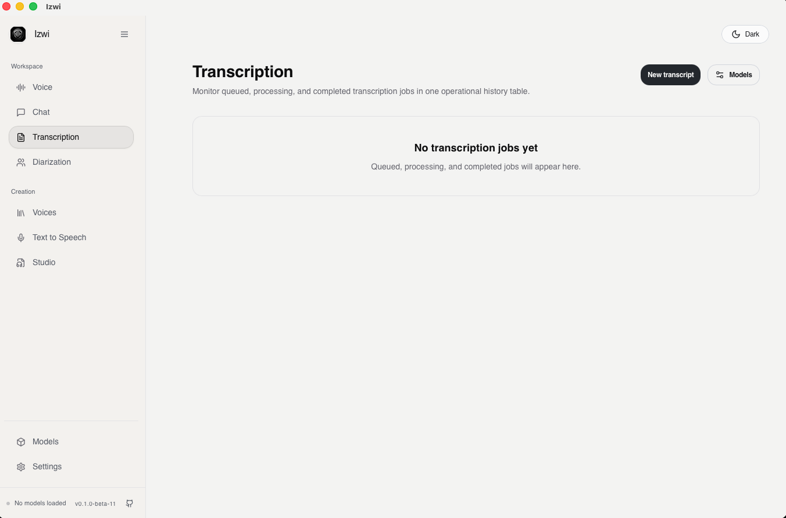

<p align="center">
  
</p>

<h1 align="center">Izwi</h1>

<p align="center"><strong>Local-first audio inference engine for TTS, ASR, and voice AI workflows.</strong></p>

<p align="center">
  <a href="https://izwiai.com">Website</a> •
  <a href="https://izwiai.com/docs">Documentation</a> •
  <a href="https://github.com/agentem-ai/izwi/releases">Releases</a> •
  <a href="https://izwiai.com/docs/getting-started">Getting Started</a>
</p>

<p align="center">
  
</p>

---

## Overview

Izwi is a privacy-focused audio AI platform that runs entirely on your machine. No cloud services, no API keys, no data leaving your device.

**Core capabilities:**

- **Voice Mode** — Real-time voice conversations with AI
- **Text-to-Speech** — Generate natural speech from text
- **Speech Recognition** — Convert audio to text with high accuracy
- **Speaker Diarization** — Identify and separate multiple speakers
- **Voice Cloning** — Clone any voice from a short audio sample
- **Voice Design** — Create custom voices from text descriptions
- **Forced Alignment** — Word-level audio-text alignment
- **Chat** — Text-based AI conversations

The server exposes OpenAI-compatible API routes under `/v1`.

---

## Quick Install

### macOS

Download the latest `.dmg` from [GitHub Releases](https://github.com/agentem-ai/izwi/releases):

1. Open the `.dmg` file
2. Drag **Izwi.app** to Applications
3. Launch Izwi

### Linux

```bash
wget https://github.com/agentem-ai/izwi/releases/latest/download/izwi_amd64.deb
sudo dpkg -i izwi_amd64.deb
```

### Windows

Download and run the installer from [GitHub Releases](https://github.com/agentem-ai/izwi/releases).

> **Full installation guides:** [macOS](https://izwiai.com/docs/installation/macos) • [Linux](https://izwiai.com/docs/installation/linux) • [Windows](https://izwiai.com/docs/installation/windows) • [From Source](https://izwiai.com/docs/installation/from-source)

---

## Quick Start

### 1. Start the server

```bash
izwi serve
```

Open `http://localhost:8080` in your browser.

### 2. Download a model

```bash
izwi pull Qwen3-TTS-12Hz-0.6B-Base
```

### 3. Generate speech

```bash
izwi tts "Hello from Izwi!" --output hello.wav
```

### 4. Transcribe audio

```bash
izwi pull Qwen3-ASR-0.6B
izwi transcribe audio.wav
```

Long-form ASR is handled automatically: Izwi now chunks long recordings,
stitches overlapping transcripts, and returns a full transcript instead of
only the first model window.

Optional tuning knobs:

```bash
IZWI_ASR_CHUNK_TARGET_SECS=24
IZWI_ASR_CHUNK_MAX_SECS=30
IZWI_ASR_CHUNK_OVERLAP_SECS=3
```

---

## Supported Models

| Category | Models |
|----------|--------|
| **TTS** | Qwen3-TTS (0.6B, 1.7B), LFM2-Audio |
| **ASR** | Qwen3-ASR (0.6B, 1.7B), Parakeet TDT |
| **Diarization** | Sortformer 4-speaker |
| **Chat** | Qwen3 (0.6B, 1.7B), Gemma 3 (1B, 4B) |
| **Alignment** | Qwen3-ForcedAligner |

Run `izwi list` to see all available models.

> **Full model documentation:** [Models Guide](https://izwiai.com/docs/models)

---

## Documentation

| Resource | Link |
|----------|------|
| **Getting Started** | [izwiai.com/docs/getting-started](https://izwiai.com/docs/getting-started) |
| **Installation** | [izwiai.com/docs/installation](https://izwiai.com/docs/installation) |
| **Features** | [izwiai.com/docs/features](https://izwiai.com/docs/features) |
| **CLI Reference** | [izwiai.com/docs/cli](https://izwiai.com/docs/cli) |
| **Models** | [izwiai.com/docs/models](https://izwiai.com/docs/models) |
| **Troubleshooting** | [izwiai.com/docs/troubleshooting](https://izwiai.com/docs/troubleshooting) |

---

## License

Apache 2.0

## Acknowledgments

- [Qwen3-TTS](https://github.com/QwenLM/Qwen3-TTS) by Alibaba
- [Parakeet](https://huggingface.co/nvidia/parakeet-tdt-0.6b-v2) by NVIDIA
- [Gemma](https://ai.google.dev/gemma) by Google
- [LFM2-Audio](https://www.liquid.ai/) by Liquid AI
- [HuggingFace Hub](https://huggingface.co/) for model hosting
